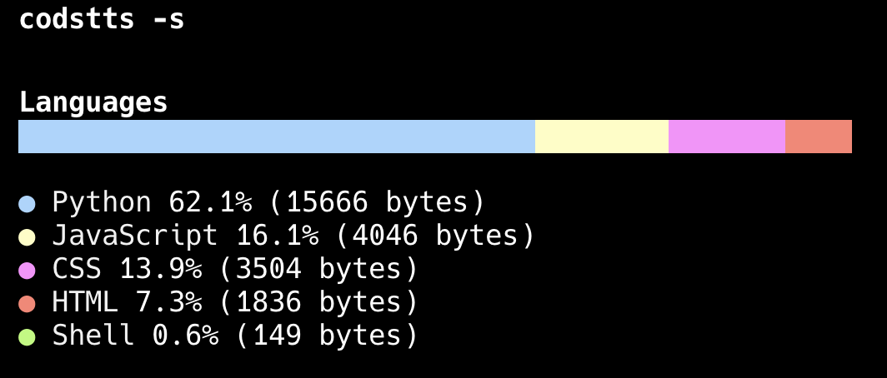

# Codstts
    

English | [中文](./README_zh.md)
## 🌟 Overview
A code statistics tool written in Rust that analyzes programming language distribution in projects.

## 🚀 Features
- Multiple programming language recognition
- Simple and detailed display modes
- Customizable configuration
- Accurate code, comment, and blank line counting
- Beautiful command-line interface
- Support for .gitattributes language overrides
- Ignores common binary files, documentation, and configuration files

## Installation

```bash
cargo install codstts
```

## Usage

Basic usage:

```bash
# Analyze current directory
codstts

# Use simple mode
codstts -s

# Use detailed mode
codstts -d

# Analyze specific directory
codstts path/to/your/project
```

### Configuration

You can create a `.codstts.toml` file in your project root for custom configuration:

```toml
# Paths to ignore
ignore_paths = ["vendor", "node_modules"]

# Language mappings
[language_mappings]
"jsx" = "React"
"tsx" = "React"

# Extensions to exclude
exclude_extensions = ["log", "tmp"]

# Files to exclude
exclude_files = ["LICENSE", "README.md"]
```

## Output Examples


Detailed mode includes additional information such as code lines, comment lines, etc.

## License

This project is open-sourced under the [MIT](./LICENSE)

## Contributing

Issues and Pull Requests are welcome!