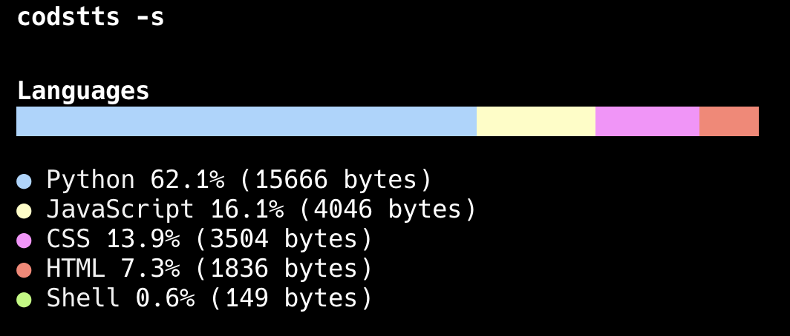

# Codstts
    
[English](./README.md) | 中文
 ## 🌟 概述
一个用 Rust 编写的代码统计工具,用于分析项目中的编程语言分布情况。

## 🚀 功能特性

- 支持多种编程语言识别
- 简单和详细两种显示模式
- 支持自定义配置
- 准确的代码、注释、空行统计
- 美观的命令行输出界面
- 支持 .gitattributes 语言覆盖
- 忽略常见的二进制文件、文档和配置文件

## 安装

```bash
cargo install codstts
```

## 使用方法

基本用法:

```bash
# 分析当前目录
codstts

# 使用简单模式
codstts -s

# 使用详细模式
codstts -d

# 分析指定目录
codstts path/to/your/project
```

### 配置文件

你可以在项目根目录创建 `.codstts.toml` 文件来自定义配置:

```toml
# 忽略的路径
ignore_paths = ["vendor", "node_modules"]

# 语言映射
[language_mappings]
"jsx" = "React"
"tsx" = "React"

# 排除的文件扩展名
exclude_extensions = ["log", "tmp"]

# 排除的文件名
exclude_files = ["LICENSE", "README.md"]
```

## 输出示例



详细模式包含更多信息,如代码行数、注释行数等。

## 许可证

这个项目是基于 MIT 许可证开源的。

## 贡献

欢迎提交 Issues 和 Pull Requests!